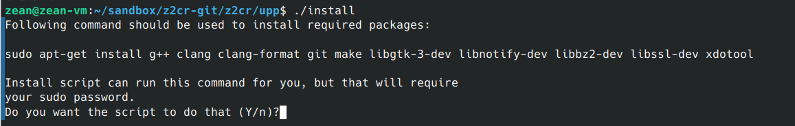
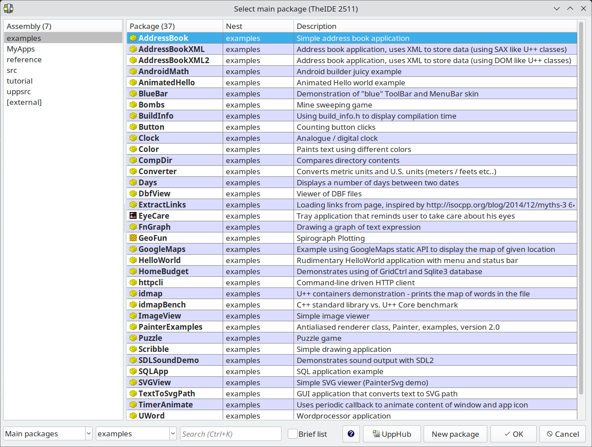

# Compiling from sources

Compiling from sources isn't particularly hard, but with multiple operating systems and having some other software dependencies, some of which may not in standards repositories or may not have standard build procedures, it can be an error prone process. The non-standard workflow does allow for multiple ways to get it functioning and advanced suer can shortcut some steps, but this guide will present one solution that is not particularly flexible, uses a sandboxed approach, but is less error prone.

If your system is available as a precompiled package, it is easier to just download it from [GitHub releases](https://github.com/MasterZean/z2cr/releases), but the option of building yourself is always available.

## Compiling under Linux

First we'll detail building from sources under Linux, where such an action is more expected and because of the myriad of Linux distributions, you might not find a precompiled binary.

### Building U++

Z2CR uses the [U++ Framework](https://github.com/MasterZean/z2cr/releases). As the compiler matures, it is planed to phase out U++ for the command line tools and use instead the Z2 standard library, but for GUI U++ will be used going further.

U++ is a standalone development framework that has its own building instructions that you can find under its documentation and if you already have it installed, advanced users can immediately compile Z2CR, especially if they open up TheIDE, configure a couple of source paths and within a few clicks, have a working Z2CR starting with nothing but a git clone.

But this guide will build U++ from sources in a nonstandard location so that the build scripts can pick it up and do all the work without you having to learn TheIDE.

For the first step, within your home directory under Linux, we'll created a new folder called `sandbox`, where we'll build sandboxed versions of U++ and Z2CR:

> mkdir sandbox
> cd sandbox

Under we'll created a folder to house the the git clone of the Z2 project source:

> mkdir z2cr-git
> cd z2cr-git
> git clone https://github.com/MasterZean/z2cr.git
> cd z2cr

Then we'll download the latest Linux release from [U++ Downloads](https://www.ultimatepp.org/www$uppweb$download$en-us.html) into this folder, for example, at the moment of writing, `upp-posix-18467.tar.xz` and unpack it here:

> tar -xvf upp-posix-18467.tar.xz

You should get a fresh U++ source code copy under the folder `upp`. We can `cd` into it to make sure everything is ok and see if the install script is available:

> cd ~/sandbox/z2cr-git/z2cr/upp
> ls install

The `install` script will install the dependencies of U++ and the build the package if no error is encountered. It will use the package manager of your distribution to get official packages for said dependencies. It might ask for permission or your sudo password. Here is a sample of what you might encounter:

#### Sample output from a system that already has all the dependencies:
> g++ is already the newest version (4:13.2.0-7ubuntu1).
> clang is already the newest version (1:18.0-59~exp2).
> clang-format is already the newest version (1:18.0-59~exp2).
> git is already the newest version (1:2.43.0-1ubuntu7.3).
> make is already the newest version (4.3-4.1build2).
> libgtk-3-dev is already the newest version (3.24.41-4ubuntu1.3).
> libnotify-dev is already the newest version (0.8.3-1build2).
> libbz2-dev is already the newest version (1.0.8-5.1build0.1).
> libssl-dev is already the newest version (3.0.13-0ubuntu3.7).
> xdotool is already the newest version (1:3.20160805.1-5build1).
> 0 upgraded, 0 newly installed, 0 to remove and 329 not upgraded.

Finally, it will ask you if you want to use prebuilt `umks32` to speed up the process.

> Use prebuilt binary umks32 to accelerate the build (Y/n)? Y

You can hit 'Y'. After a relatively short build time where the script will constantly inform you that you are on package X of total N, if no errors were encountered, it will pose one final question:

> OK. (0:39.64)
> Install process has been finished, TheIDE is built as ./theide
> Do you want to start TheIDE now? (Y/n):

You can hit 'Y' and see if TheIDE was built and runs successfully. TheIDE will show a splash screen, do some setup and finally show the package selection dialog:

