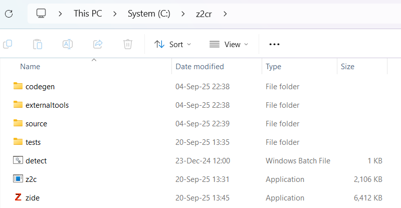
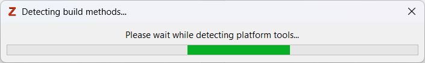
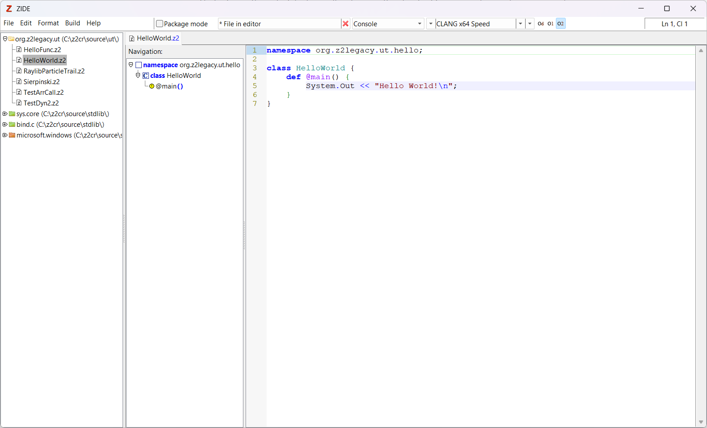

# Installing and getting started

This section will detail how to install Z2 ang get started with it, compiling "Hello world", other samples and writing you own first programs, using the  [pre-compiled releases](https://github.com/MasterZean/z2cr/releases) under Windows or Linux.

If instead you wish to compile from source, a more advanced topic, see [compiling from sources]().

## Installing under windows

The first step would be checking out the  [pre-compiled releases](https://github.com/MasterZean/z2cr/releases) page from GitHub. 

Here you will the list of pre-compiled releases. In general, it is a good idea to take the latest release.

At the moment of writing this, this will be around 0.4. Grab the appropriate ZIP archive. If you open it up, you will find that it contains a single folder: `z2cr`.

You can copy this folder anywhere you wish on your Windows system, but the rest of this guide will assume that you installed in your root C: partition, so the install path for Z2 will be: `C:\z2cr`. 

 #### Note on release names:
> Releases have names like Z2CR 0.4.pre-alpha (Win32 x64 + Clang 18.1.5)].
> Z2CR is the name of the project and is the Z@ compiler
> 0.4.pre-alpha is the version of the compiler and it states that it is currently a pre-alpha
> Within parenthesis you will find the target version. Win32 x64means this is a binary for Windows, compiled to 64 bits.
> If within the parenthesis you find another string, like Clang 18.1.5, this means that this build comes bundled with a backend compiler. Grab one of these if you desire to compile out of the box and your system has no compatible backend compilers installed.
> 
> This release name will translate to a much simpler archived package name: z2cr-0.4-pre-alpha-win32.zip

You should end up with the following folder:

### Build environment integration and detection

Z2 does not create its own build and code generation ecosystem, but instead focuses on perfectly integrating into an existing system, using the tools and processes you already use.

This means it will try to auto-detect said tools.

Under Windows, it will try to detect any compatible properly installed version of Microsoft Visual Studio with C++ compiler support. If you do not have such and installation of autodetection fails, it is traditional for precompiled for Windows distributions of Z2 to come with a bundled CLANG or GCC, allowing you to build out of the box. Still bundled toolkit will also be autodetected.

Under Linux, the autodetection will pick up on the standard C++ compiler you have previously installed using your distribution's package manager.

Auto-detection is quite an involved process and can be difficult to account for all the possible setups, so it can be a slow process. If you have a system with many compilers, it might take a double digit number of seconds, so please have patience. But you need to run it only once.

The Z2 package comes with ZIDE (zide.exe), a small IDE that supports Z2. ZIDE, upon first tun, will run auto-detection and will show a UI progress indicator:

The Z2 Compiler, Z2C (z2c.exe) will also auto-detect your build environment, but only when actually attempting to compile something for the first time.

The results of the autodetection are cached in the buildMethods.xml file (` c:\z2cr\buildMethods.xml`). This is a plain and fairly straight forward XML file, storing one entry for each detected build system and its settings. If you install or remove a build system from your computer, you must re-run the auto-detection step for it to update its list of available tools. Alternatively, you can edit buildMethods.xml manually.

With auto-detection having run once and presuming no errors, you will be greeted by ZIDE having opened the samples folder and the "HelloWorld" sample:

Now you can press F5 and it will build your sample and all its dependencies and then run the program!

